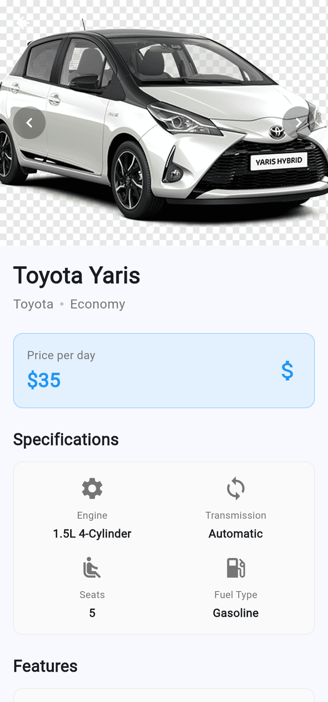
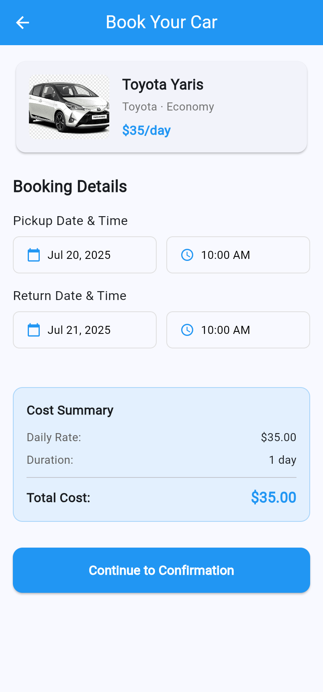

# Car Booking App

A modern Flutter application for booking rental cars with an intuitive user interface and comprehensive booking management.

<div align="center">
  <h2>Car Booking App Screenshot</h2>
  
</div>

## Features

- **Browse Cars**: Explore a diverse collection of rental cars with detailed specifications
- **Advanced Filtering**: Filter cars by type, brand, price range, and features
- **Detailed Car Information**: View comprehensive details including specifications, features, and high-quality images
- **Booking Management**: Create, view, and manage your car bookings
- **Intuitive Booking Process**: Simple step-by-step booking flow with date/time selection
- **Booking Status Tracking**: Track the status of your bookings (pending, confirmed, active, completed, cancelled)
- **Cost Calculation**: Real-time cost calculation based on rental duration

## Tech Stack

- **Flutter**: Cross-platform UI framework
- **Provider**: State management solution
- **Intl**: Internationalization and date formatting
- **Unit & Widget Testing**: Comprehensive test coverage

## Project Structure

```
lib/
├── data/           # Data sources and repositories
├── models/         # Data models
├── providers/      # State management
├── routes/         # App navigation
├── screens/        # UI screens
├── services/       # Business logic services
├── utils/          # Utility functions
└── widgets/        # Reusable UI components
```

## Getting Started

### Prerequisites

- Flutter SDK (latest stable version)
- Dart SDK
- Android Studio / VS Code with Flutter plugins

### Installation

1. Clone the repository:
```bash
git clone https://github.com/SallahBoussettah/CarBookingApp.git
```

2. Navigate to the project directory:
```bash
cd car_booking_app
```

3. Install dependencies:
```bash
flutter pub get
```

4. Run the app:
```bash
flutter run
```

## Testing

Run the tests with:
```bash
flutter test
```

## Screenshots

<div align="center">
  <table>
    <tr>
      <td></td>
      <td></td>
      <td></td>
      <td></td>
    </tr>
    <tr>
      <td align="center">Home Screen</td>
      <td align="center">Car Details</td>
      <td align="center">Booking Form</td>
      <td align="center">Bookings List</td>
    </tr>
  </table>
</div>

## Roadmap

- User authentication and profiles
- Payment integration
- Push notifications
- Offline support
- Multi-language support

## Contributing

Contributions are welcome! Please feel free to submit a Pull Request.

## License

This project is licensed under the MIT License - see the LICENSE file for details.
